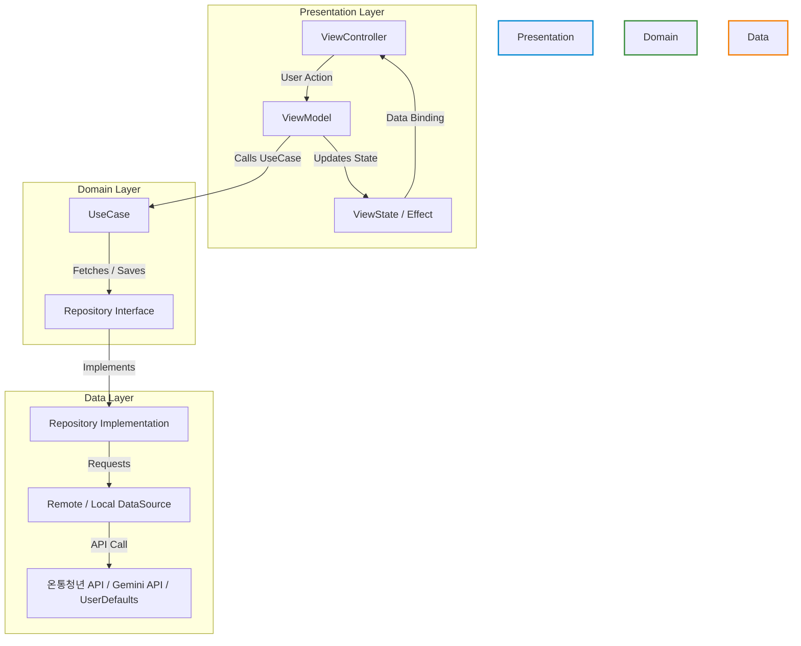

# 🧲 YouthBridge (청년 브릿지)

> **청년들을 위한 공공 정책 정보 플랫폼**  
> 온통청년 API와 Gemini AI 기술을 결합하여, 복잡한 국가 정책을 한눈에 파악하고 맞춤형 혜택을 챙길 수 있도록 돕는 iOS 애플리케이션입니다.

---

## 📱 주요 기능

* **🏠 홈 피드 (Home Feed)**
  * **긴급 공고**: 마감 임박 정책(D-7 이내)을 상단 캐러셀로 우선 노출하여 적시 신청 유도.
  * **정책 리스트**: 20개 단위 무한 스크롤(Pagination)을 통한 원활한 데이터 조회.
  * **D-Day 배지**: 정책별 마감 기한을 분석하여 실시간 상태 배지(상시, 마감, D-Day) 부여.

* **🔍 스마트 검색 및 필터 (Search & Filter)**
  * **다차원 필터링**: 지역(5열 글래스 칩), 카테고리(벤토 카드 구조), 정책 상태를 클라이언트 사이드에서 조합 필터링.
  * **검색어 관리**: 최근 검색어 자동 저장(최대 10개, 스와이프 삭제 가능) 및 실시간 인기 검색 키워드 추천.

* **📖 AI 3줄 요약 및 상세 보기 (Detail & AI Summary)**
  * **Gemini AI 요약**: 복잡한 정책 지원 내용을 `gemini-2.5-flash` 모델을 통해 대학생 타겟 핵심 3줄(혜택, 자격, 주의사항)로 인공지능 요약.
  * **원클릭 신청**: 외부 포털 신청 페이지로 즉시 랜딩되는 `SFSafariViewController` 연동.

* **💾 스크랩 및 알림 (Scrap & Push Notification)**
  * **북마크**: 마음에 드는 정책을 즉시 보관하고 `UserDefaults` 기반 로컬 스토리지에 유지.
  * **마감 사전 알림**: 스크랩한 정책의 마감 7일 전, 로컬 알림(`UNUserNotificationCenter`)을 통해 리마인드 제공.

---

## 🛠 기술 스택 (Tech Stack)

| 영역 | 적용 기술 / 프레임워크 | 설명 |
|---|---|---|
| **UI** | UIKit | 코드 기반 화면 및 오토레이아웃 설계 |
| **Architecture** | MVVM + MVI + Clean Architecture | 액션(Action)과 상태(State) 중심의 단방향 데이터 흐름 제어 |
| **Reactive** | Combine | 비동기 바인딩 및 데이터 스트림 처리 (`PassthroughSubject`, `@Published`) |
| **Concurrency** | Swift Concurrency (async/await) | 안전하고 가독성 높은 비동기 API 통신 처리 |
| **Database/Local**| UserDefaults | 가벼운 스크랩 상태 및 최근 검색 기록 로컬 캐싱 |
| **AI Summary** | Gemini REST API | `gemini-2.5-flash` 모델을 활용한 요약 인프라 |

---

## 📐 아키텍처 & 데이터 흐름 (Architecture)

프로젝트는 데이터 변화가 단방향으로 흐르는 **Clean Architecture + MVI** 구조로 설계되었습니다.



---

## 📁 폴더 구조 (Folder Structure)

```
YouthBridge/
├── Common/
│   ├── DI/                     # 의존성 주입을 위한 DIContainer
│   ├── DesignSystem/           # 공통 컬러 및 폰트 정의
│   └── Extensions/             # 날짜 등 파싱 유틸리티
│
├── Domain/
│   ├── Entities/               # Policy 도메인 모델
│   ├── Repositories/           # Repository 프로토콜 정의
│   └── UseCases/               # 단일 책임 원칙에 따른 유스케이스 구현
│
├── Data/
│   ├── DTOs/                   # API 응답 파싱 모델
│   ├── Mappers/                # DTO ➔ 도메인 모델 변환 매퍼
│   ├── DataSources/            # Remote(OpenAPI, Gemini) & Local DataSources
│   └── Repositories/           # Repository 프로토콜 실체 구현체
│
└── Presentation/               # MVI 패턴 기반의 View-ViewModel 레이어
    ├── Common/                 # 공통 UI 컴포넌트 및 TableView Cell
    ├── Home/                   # 홈 피드 화면
    ├── Detail/                 # 정책 상세 및 AI 요약 화면
    ├── Filter/                 # 지역/카테고리/상태 필터 모달
    ├── Search/                 # 검색 및 최근검색어 화면
    ├── MyPage/                 # 프로필 및 스크랩 관리 화면
    └── Notifications/          # 알림함 화면
```

---

## 🔑 시작하기 (Getting Started)

본 프로젝트는 보안을 위해 API Key 값을 하드코딩하지 않고 별도의 외부 설정 파일로 관리합니다.

1. 프로젝트 루트 경로의 `YouthBridge/` 디렉토리 밑에 `Config.plist` 파일을 생성합니다.
2. 생성한 `Config.plist`에 아래와 같이 Key-Value를 추가해 줍니다:

```xml
<?xml version="1.0" encoding="UTF-8"?>
<!DOCTYPE plist PUBLIC "-//Apple//DTD PLIST 1.0//EN" "http://www.apple.com/DTDs/PropertyList-1.0.dtd">
<plist version="1.0">
<dict>
    <key>YOUTH_POLICY_API_KEY</key>
    <string>발급받으신_온통청년_API_키</string>
    <key>GEMINI_API_KEY</key>
    <string>발급받으신_Gemini_API_키</string>
</dict>
</plist>
```

> ⚠️ **주의**: `Config.plist` 파일은 `.gitignore`에 등록되어 있으므로 Git에 커밋되지 않도록 확인해 주세요.
